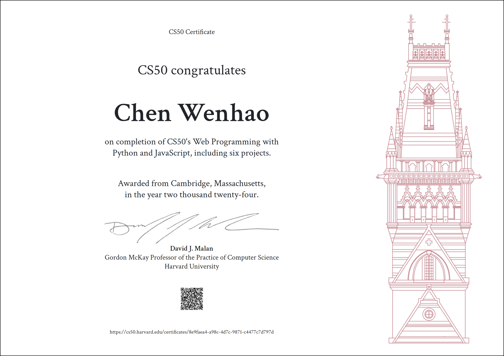

# CS50x

This course teaches how to program fundamentally and how to teach yourself new languages ultimately. The course starts with a traditional but omnipresent language called C that underlies today’s newer languages, via which you’ll learn not only about functions, variables, conditionals, loops, and more, but also about how computers themselves work underneath the hood, memory and all. The course then transitions to Python, a higher-level language that you’ll understand all the more because of C. Toward term’s end, the course introduces SQL, along with HTML, CSS, and JavaScript, via which you can create web and mobile apps alike.

# CS50W

This course picks up where CS50x leaves off, diving more deeply into the design and implementation of web apps with Python, JavaScript, and SQL using frameworks like Django, React, and Bootstrap. Topics include database design, scalability, security, and user experience. Through hands-on projects, students learn to write and use APIs, create interactive UIs, and leverage cloud services like GitHub and Heroku. By semester’s end, students emerge with knowledge and experience in principles, languages, and tools that empower them to design and deploy applications on the Internet.

# CS50P

An introduction to programming using Python. Learn how to read and write code as well as how to test and “debug” it. Designed for students with or without prior programming experience who’d like to learn Python specifically. Learn about functions, arguments, and return values (oh my!); variables and types; conditionals and Boolean expressions; and loops. Learn how to handle exceptions, find and fix bugs, and write unit tests; use third-party libraries; validate and extract data with regular expressions; model real-world entities with classes, objects, methods, and properties; and read and write files. Hands-on opportunities for lots of practice. Exercises inspired by real-world programming problems.

# Advanced React

The best learning experience paired with a world-class instructor. This massive course aims to turn into hireable React developer as fast as possible.
To get a deep understanding of Reusability.
Learn one of the most used React library React Router6.
Deep understand how to improve performance.

